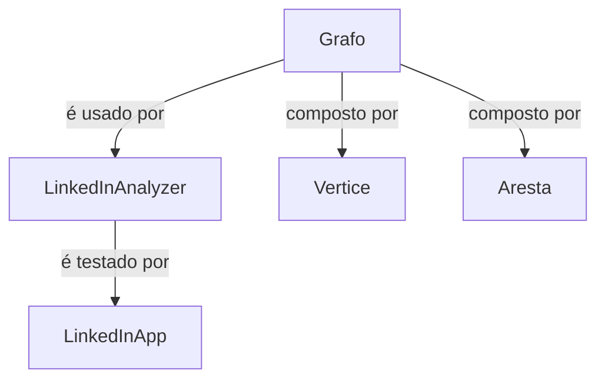

# 🔗 LinkedIn Analyzer

> Um motor de análises e recomendações para redes sociais profissionais, construído sobre uma implementação própria de **Grafos** em Java.

Projeto final da disciplina de **Teoria dos Grafos**, que transforma uma estrutura de grafo genérica (dirigido/não-dirigido, ponderado/não-ponderado) em um "motor" de análises estilo LinkedIn — sugestão de conexões, grau de separação, rota de maior afinidade e mapeamento de sub-redes isoladas.

---

## 📌 Sobre o projeto

A rede de contatos é modelada como um **grafo não-direcionado e ponderado**:

| Elemento | Representa |
|---|---|
| **Vértice** | Perfil de um usuário |
| **Aresta** | Relacionamento de amizade/trabalho |
| **Peso** | Intensidade da conexão — **peso 1 = muita afinidade** (equipe/contato diário), **peso 5 = pouca afinidade** (conexão distante) |

> ⚠️ Quanto **menor** o peso, **maior** a afinidade entre as pessoas.

---

## ✨ Funcionalidades (Missões)

| # | Missão | Descrição |
|---|---|---|
| 1 | **Construtor da Análise** | Recebe e guarda a instância do `Grafo` que representa a rede social |
| 2 | **Sugestão de Conexões** | Encontra "amigos de amigos" (2º grau), ordenados pela quantidade de amigos em comum |
| 3 | **Grau de Separação** | Calcula quantos saltos (ignorando pesos) separam duas pessoas na rede |
| 4 | **Rota de Maior Afinidade** | Usa **Dijkstra** para encontrar o caminho de menor custo acumulado (= maior afinidade) entre duas pessoas |
| 5 | **Grupos Isolados** | Mapeia todas as sub-redes (componentes conexos) desconectadas entre si |

---

## 🧠 Por que Dijkstra?

O menor **número de saltos** entre duas pessoas nem sempre é a rota de **maior afinidade real**. O projeto prova isso com um cenário concreto:

```
Rota com menos saltos:      Ana → Daniela → Fernanda        (2 saltos, custo = 13)
Rota de maior afinidade:    Ana → Bruno → Eduardo → Fernanda (3 saltos, custo = 3)
```

Como todos os pesos da rede são positivos, o **Dijkstra** é o algoritmo clássico adequado para encontrar essa rota de menor custo ponderado.

---

## 🗂️ Estrutura do projeto

```
src/main/java/br/com/unipe/
├── Vertice.java             # Representa um usuário/perfil (nome, grau, adjacências)
├── Aresta.java               # Representa uma conexão entre dois usuários (com peso)
├── Grafo.java                 # Estrutura de grafo genérica + Dijkstra
├── LinkedInAnalyzer.java      # Motor de análises (as 4 missões)
├── LinkedInApp.java           # Cenário de testes + demonstração via main()
└── Main.java                  # main() original do grafo base (não modificado)
```

---

## 🏗️ Arquitetura



- **`Grafo`**: estrutura de dados genérica e reutilizável (não conhece nada sobre "LinkedIn").
- **`LinkedInAnalyzer`**: camada de domínio, reaproveita os métodos públicos do `Grafo` (`encontraVertice`, `getAdjacencias`, `dfsIterativo`, `encontraRotaDeMaiorAfinidade`) sem duplicar lógica.
- **`LinkedInApp`**: ponto de entrada que monta o cenário de teste e imprime os resultados.

---

## 🚀 Como rodar

### Pré-requisitos
- **Java 25** (o código usa `record` e *text blocks*, então o piso técnico mínimo é Java 17, mas o projeto foi desenvolvido e testado em Java 25)
- **Lombok** — necessário em tempo de **compilação** (gera os getters/setters de `Vertice` e `Aresta`); não é necessário em tempo de execução
  - Se estiver usando Maven/Gradle, basta declarar o Lombok como dependência (`provided`/`compileOnly`) e habilitar *annotation processing* na IDE
  - Se for compilar via linha de comando, baixe o `lombok.jar` em [projectlombok.org/download](https://projectlombok.org/download)

### Executando

```bash
# Compile o projeto (lombok.jar precisa estar no classpath em tempo de compilação)
javac -cp lombok.jar -d out src/main/java/br/com/unipe/*.java

# Rode o cenário de demonstração do LinkedIn Analyzer
java -cp out br.com.unipe.LinkedInApp
```

> 💡 O `Main.java` original (grafo genérico dirigido/ponderado) continua funcional e pode ser executado separadamente com `java -cp out br.com.unipe.Main`.

---

## 🧪 Cenário de testes

**Rede principal:** Ana, Bruno, Carlos, Daniela, Eduardo, Fernanda
**Grupo isolado 1:** Gabriel ↔ Hugo
**Grupo isolado 2:** Igor ↔ Juliana

| Conexão | Peso |
|---|---|
| Ana ↔ Bruno | 1 |
| Ana ↔ Carlos | 2 |
| Ana ↔ Daniela | 8 |
| Bruno ↔ Eduardo | 1 |
| Carlos ↔ Eduardo | 1 |
| Daniela ↔ Fernanda | 5 |
| Eduardo ↔ Fernanda | 1 |
| Gabriel ↔ Hugo | 1 |
| Igor ↔ Juliana | 1 |

### Saída esperada (resumida)

```
===== Missão 2: Sugestão de Conexões (amigos de 2º grau) =====
Sugestões para Ana: [SugestaoDeConexao[nome=Eduardo, amigosEmComum=2]]

===== Missão 3: Grau de Separação =====
Grau de separação entre Ana e Fernanda: 2 salto(s)
Grau de separação entre Ana e Igor (grupos isolados, sem conexão): -1

===== Missão 4: Rota e Custo de Maior Afinidade (Dijkstra) =====
Rota de maior afinidade de Ana até Fernanda: [Ana, Bruno, Eduardo, Fernanda]
Custo total da rota: 3

===== Missão 5: Mapear Grupos Isolados (Sub-redes) =====
Grupo: [Ana, Bruno, Carlos, Daniela, Eduardo, Fernanda]
Grupo: [Gabriel, Hugo]
Grupo: [Igor, Juliana]
```

---

## 🛠️ Tecnologias

- **Java 25**
- **Lombok** (`@Getter`, `@Setter`) para reduzir boilerplate em `Vertice` e `Aresta`
- **Java Collections & Streams** (`PriorityQueue`, `HashMap`, `Optional`, `Comparator`)

---

## 📄 Licença

Projeto acadêmico desenvolvido para fins educacionais na disciplina de Teoria dos Grafos.

---

## 👤 Autores

- [Rafael Magno G.](https://github.com/rafaelmagnog)
- [Levi Adler](https://github.com/LeviAdler05)
- [Renato Alexandre](https://github.com/RenatoAlexandre06)
- [José Henrique](https://github.com/josehmelo)
- [Hugo Lins](https://github.com/HugoLinsX)
